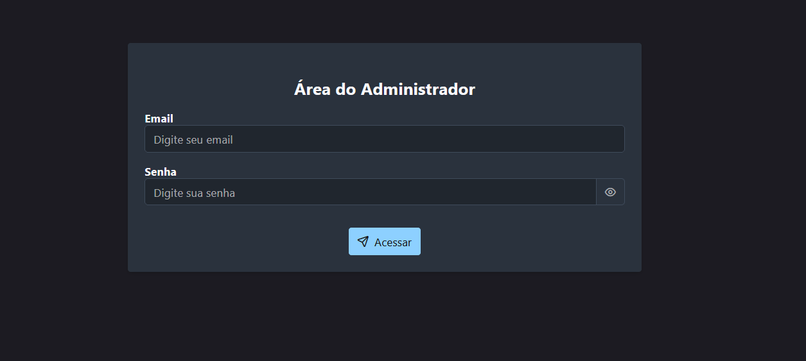
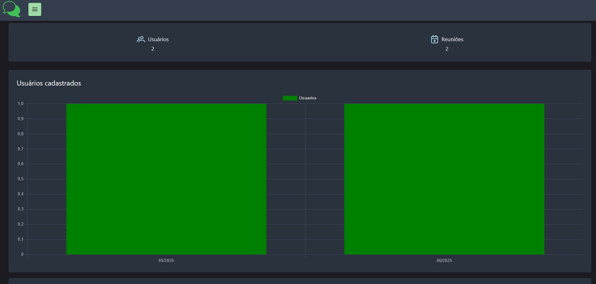
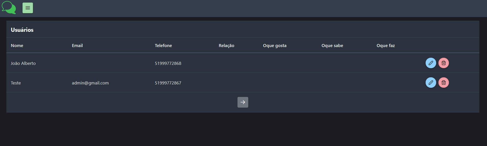
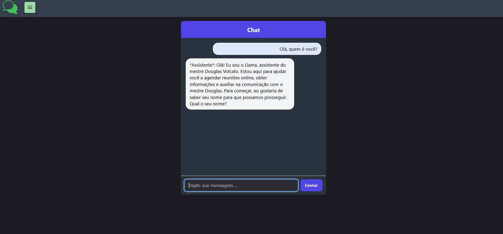
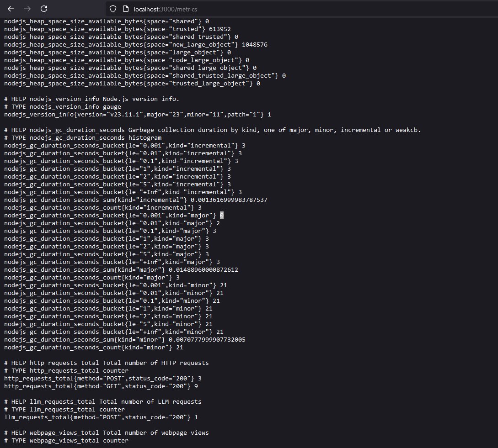
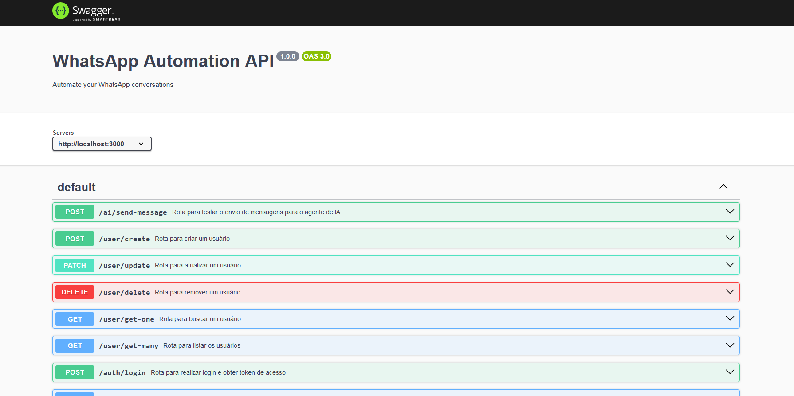
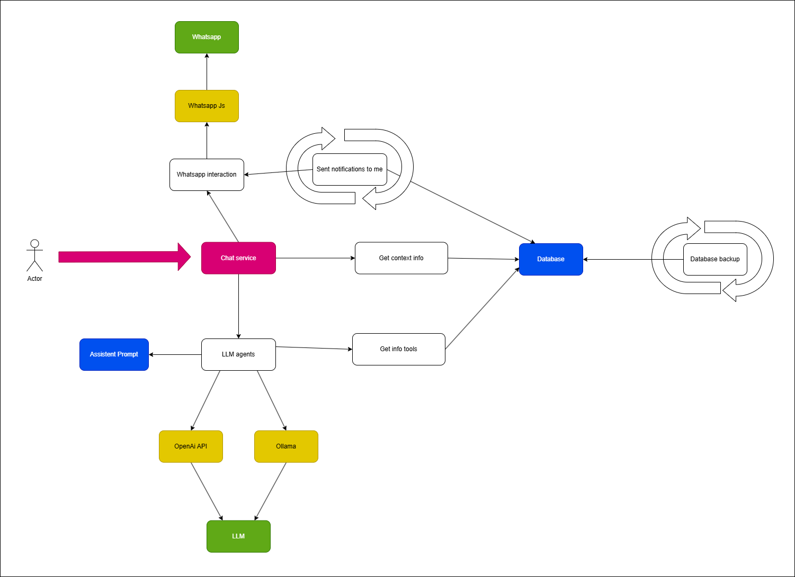
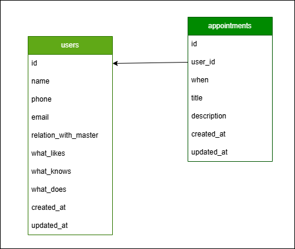

# 🤖 WhatsApp Automation Agent

> Automate WhatsApp workflows using an LLM-powered agent that understands your domain and business needs.

[](https://github.com/DouglasVolcato/whatsapp-automation-agent)
[](https://nodejs.org/)
[](https://www.postgresql.org/)
[](LICENSE)

---

## 📦 Project Overview

The WhatsApp Automation Agent combines **AI language models**, **web automation**, and a robust **dashboard** to create a flexible automation platform for WhatsApp interactions.

Features:
- Automate conversations and workflows
- Manage users and sessions via a secure admin dashboard
- Observe system metrics and performance
- Integrate LLM agents and tools tailored to your domain

---

## 🧭 Table of Contents

- [🧭 Table of Contents](#-table-of-contents)
- [📸 App Screenshots](#-app-screenshots)
- [🧩 Architecture Diagrams](#-architecture-diagrams)
- [⚙️ Project Structure](#️-project-structure)
- [🚀 Technologies & Tools](#-technologies--tools)
- [📦 Installation](#-installation)
- [📄 License](#-license)

---

## 📸 App Screenshots

| Login                | Dashboard Session       | Manage Users                |
| -------------------- | ---------------------- | --------------------------- |
|  |  |  |

| LLM Chat             | Metrics Collection     | API Documentation (Swagger) |
| -------------------- | ---------------------- | --------------------------- |
|  |  |  |

---

## 🧩 Architecture Diagrams

| Application Architecture | Database Design |
| ----------------------- | ---------------- |
|  |  |

---

## ⚙️ Project Structure

```plaintext
docker-compose.yml
.env.example
app
├─ db                 # SQL migrations
├─ dist               # Compiled backend
├─ logs               # Logs
├─ src
│  ├─ domain
│  │  ├─ abstract
│  │  ├─ controllers
│  │  ├─ middlewares
│  │  ├─ usecases
│  │  └─ utils
│  ├─ ia
│  │  ├─ abstract
│  │  ├─ agents
│  │  └─ tools
│  ├─ infra
│  │  ├─ database
│  │  └─ repositories
│  └─ main
│     ├─ abstract
│     ├─ factories
│     ├─ routes
│     ├─ utils
│     └─ index.ts
├─ public
│  ├─ views            # EJS templates
│  ├─ files            # Static files
│  └─ client           # React frontend
│     ├─ dist
│     ├─ public
│     └─ src
│        ├─ app
│        ├─ components
│        ├─ config
│        ├─ contexts
│        ├─ decorators
│        ├─ enums
│        ├─ hooks
│        ├─ stores
│        └─ utils
│     └─ main.tsx
````

---

## 🚀 Technologies & Tools

### 🖥 Backend

* **Node.js** & **TypeScript**: main runtime and language
* **dotenv**: environment config
* **node-cron**: task scheduling

### 🔐 Cryptography & Auth

* **bcryptjs**: password hashing
* **jsonwebtoken**: token-based authentication

### 🧾 Documentation

* **Swagger**: API documentation
* **Draw\.io**: architecture diagrams

### 🗄 Database

* **Postgres**: relational database
* **SQL optimization**: performance tuning

### 📊 Observability

* **Prometheus**: metrics collection & monitoring

### 🤖 WhatsApp Automation

* **puppeteer**: headless browser control
* **whatsapp-web.js**: WhatsApp web automation

### 🧠 LLM Integration

* **LangChain**: tool orchestration
* **Ollama**, **ChatGPT**: language models
* **zod**: validation & tool format definition

### 🌐 Frontend

* **React**: SPA dashboard
* **PrimeReact**, **PrimeIcons**, **PrimeFlex**: UI toolkit
* **Chart.js**: data visualization
* **Zustand**: state management
* **Axios**: API communication
* **EJS**: server-rendered templates
* **Static files**: public content

---

## 📦 Installation

```bash
# Clone the repository
git clone https://github.com/DouglasVolcato/whatsapp-automation-agent.git
cd whatsapp-automation-agent

# Copy environment variables template
cp .env.example .env

# Build & run using Docker
docker compose up --build

# Access
# - Server: http://localhost:PORT
# - Client: http://localhost:PORT/client
# - Docs: http://localhost:PORT/docs
```

> 🧪 Note: Ensure Docker & Docker Compose are installed.

---

## Author

* **Douglas Volcato**: [GitHub](https://github.com/DouglasVolcato)
